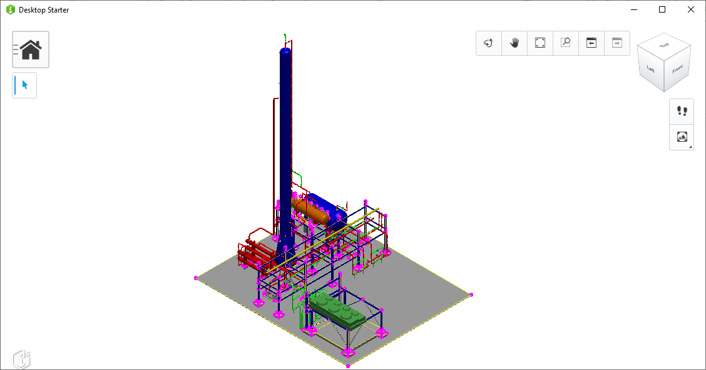

# Desktop Starter

Copyright © Bentley Systems, Inc.

This app is intended to be used as a challenge for learning about iModel.js.  Please see the [full instructions](https://imodeljsjumpstart.github.io/challenges/challenge-color-by-category.html) for the challenge.

See <http://imodeljs.org> for comprehensive documentation on the iModel.js API and the various constructs used in this app.



## Development setup

1. Install the dependencies:

    ```sh
    npm install
    ```

2. Build the app:

    ```sh
    npm run build
    ```

3. Start the app:

    ```sh
    npm start
    ```

## Contributing

[Contributing to iModel.js](https://github.com/imodeljs/imodeljs/blob/master/CONTRIBUTING.md)
